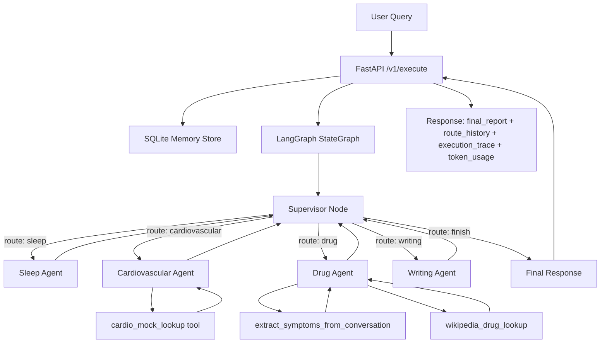

# Medical Supervisor Multi-Agent System

A FastAPI + LangGraph medical triage system where a Supervisor routes between specialist agents (sleep, cardiovascular, drug) and a writing agent for the final structured response.

## Visual Architecture



## What This Project Does

- Uses a Supervisor to decide which specialized agent should run next.
- Supports tool-augmented specialist reasoning (bind_tools with fallback).
- Returns execution trace and estimated token/cost telemetry.
- Persists conversation context in SQLite with session-based retrieval.
- Provides a polished Streamlit chat interface for easier demo and exploration.

## Project Structure

- `main.py`: FastAPI app and `/v1/execute` orchestration.
- `agents/graph.py`: LangGraph construction and routing edges.
- `agents/nodes.py`: Supervisor + specialist node logic.
- `tools/`: mock and external tool integrations.
- `database/database.py`: SQLite persistence layer.
- `utils/telemetry.py`: token/cost estimation utilities.
- `streamlit_app.py`: UI frontend for the API.
- `tests/`: architecture and API test suite.
- `Eval.md`: evaluation and stress-test analysis.

## How To Start

## 1) Prerequisites

- Python 3.12+
- A Google API key for Gemini

Set environment variable:

```bash
export GOOGLE_API_KEY="your_key_here"
```

## 2) Install Dependencies

If you already have a virtual environment in `env/`:

```bash
source env/bin/activate
pip install -r requirements.txt
```

## 3) Run FastAPI Server

```bash
uvicorn main:app --reload --host 0.0.0.0 --port 8000
```

API endpoints:

- `GET /v1/health`
- `POST /v1/execute`
- `GET /v1/session/{session_id}`
- `GET /v1/sessions`

## 4) Run Streamlit Interface

In another terminal:

```bash
source env/bin/activate
streamlit run streamlit_app.py
```

This UI gives a cleaner interactive experience, including session browsing and execution insights.

## Testing

Run the full tests:

```bash
./env/bin/python -m unittest -v tests.test_architecture tests.test_api
```

Or run module-wise:

```bash
./env/bin/python -m unittest -v tests.test_architecture
./env/bin/python -m unittest -v tests.test_api
```

The tests cover:

- Graph routing behavior and loop guards
- Tool trace integration
- Writing/fallback behavior
- API telemetry and retrieval behavior

## Notes

- Token and cost values are estimated (heuristic), not billing-exact.
- Medical output is non-diagnostic and includes safety-oriented guidance.
